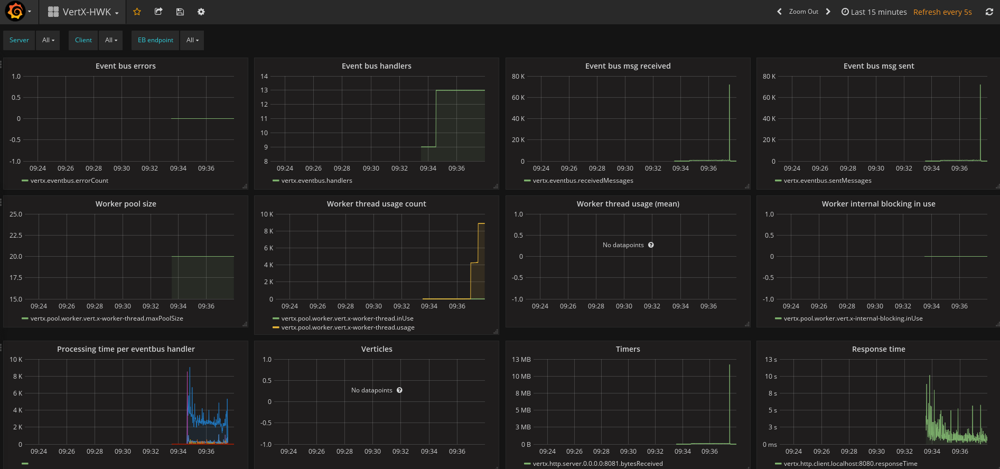
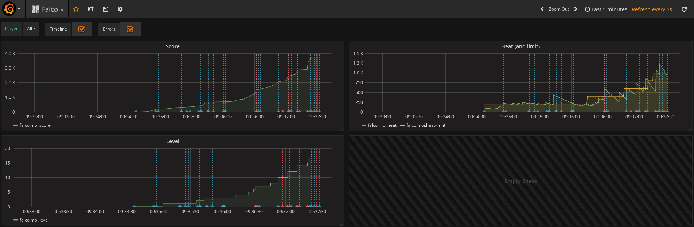

# falco-demo

Demo of Falco the Hawk.

This game illustrates some usage of [Hawkular](http://www.hawkular.org/) with [Grafana](https://grafana.com/).
The docker-compose file is made from "[Hawkular and Grafana Out of the Box](https://github.com/jotak/hawkular-grafana-outofthebox)".

## Run the game

```bash
docker-compose up
```

Open Grafana: http://localhost:3000 (_admin_/_admin_).
Two dashboards are pre-configured, you can open both.

Open the game: http://localhost:8081 and start to play!

The game itself looks like this: https://www.youtube.com/watch?v=vKuyfrQv-GU

And the dashboards:


_Vert.X_


_Game metrics_
